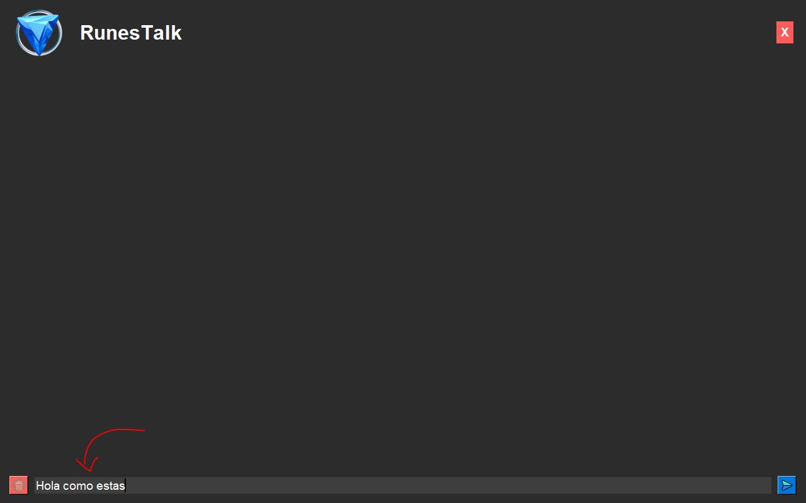
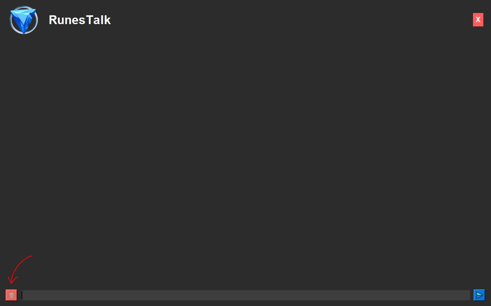

# Manual de Usuario - Runes Talk

Bienvenido al manual de usuario para interactuar con **Runes Talk**. Esta herramienta permite hacer preguntas en **español** e **inglés** sobre **JavaScript** y **Python**.

---

## 1. Preguntar a Runes Talk
Permite al usuario realizar preguntas sobre temas de JavaScript y Python. Escribe tu consulta en el cuadro de texto.

---

## 2. Enviar un Mensaje
Puedes enviar tu mensaje de las siguientes maneras:
- **Presionando la tecla "Enter"**.
- **Haciendo clic en el símbolo de la flecha azul**.

---

## 3. Esperar la Respuesta de Runes Talk
Cuando envíes un mensaje, debes esperar a que Runes Talk termine de responder antes de enviar otra consulta.

---

## 4. Borrar Contenido
Si deseas limpiar la ventana del chat, haz clic en el ícono del **cubo de basura rojo**.

---

## 5. Salir de la Aplicación
Para cerrar la aplicación, haz clic en la **X roja** ubicada en la esquina superior derecha.

---

## 6. Mensajes de Error
Si ocurre algún problema, recibirás un mensaje de error. Revisa la consulta y vuelve a intentarlo.

---

### Nota:
Esta es la interfaz principal de **Runes Talk**, diseñada para facilitar tus preguntas y respuestas.

---

¡Disfruta usando Runes Talk para aprender y resolver dudas sobre JavaScript y Python!
